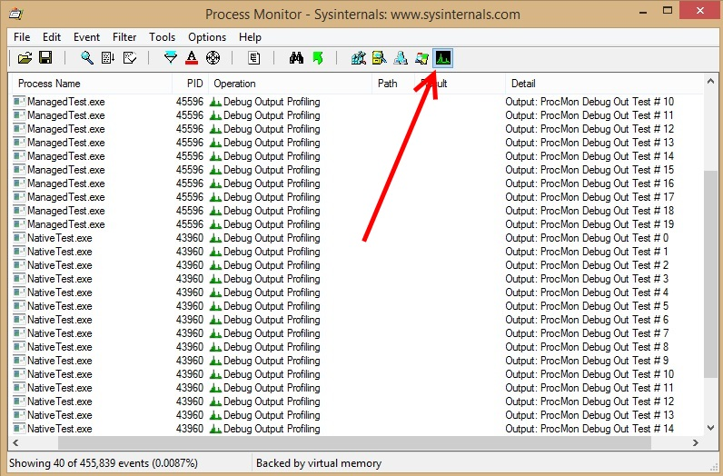
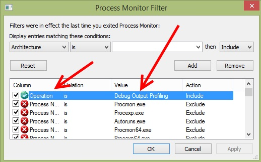

# See Your Trace Statements in Process Monitor! #
A few years ago I got together with Mark Russinovich and we implemented a technique to enable developers to push tracing statements to Process Monitor so you can more easily see where you are causing I/O operations. You can read about the initial release of the code [here](http://www.wintellect.com/blogs/jrobbins/see-the-i-o-you-caused-by-getting-your-diagnostic-tracing-into-process-monitor). I'm moving the code to GitHub as that's where all open source code should be. :)

The ProcMonDebugOutput library supports both native C++ and managed .NET languages as well as 32-bit and 64-bit. 

## Building The Code ##
All the projects are in Visual Studio 2013 format. I'm not using any advanced Premium or Ultimate features so everything should compile even with Visual Studio Express, but I have not tried.

1. Open up ProcMonDebugOutput.SLN
2. Select the Build, Batch Build menu
3. In the Batch Build dialog, click Select All button
4. Click the Build button

The 32-bit binaries build to .\Source\ReleaseWin32 and .\Source\DebugWin32.
The 64-bit binaries build to .\Source\Releasex64 and .\Source\Debugx64.

## Using with C++ Native Applications ##
For native code, you’ll need to include the header file ProcMonDebugOutput.h and link against ProcMonDebugOutputx86.lib or ProcMonDebugOutputx64.lib as appropriate. The API you’ll call is, appropriately named, *ProcMonDebugOutput* which takes a single parameter of a UNICODE string. Obviously, you’ll need to add ProcMonDebugOutputx86.DLL or ProcMonDebugOutputx64.DLL as part of your distribution. See the .\Source\NativeTest application for an example.

## Using with .NET Applications ##
For managed code, the API is wrapped up into a That means you can add ProcessMonitorTraceListener through [configuration files](http://msdn.microsoft.com/en-us/library/sk36c28t.aspx) like any TraceListener you’ve ever used. With your application you’ll only need to include Sysinternals.Debug.DLL as that's a complete managed implementation of the native API.

If you are an aficionado of Log4Net, [Justin Dearing](https://github.com/zippy1981), did the Log4Net appender so you can include Sysinternals.log4net.dll and do all your usual log4net configuration to get it working.

See the .\Source\ManagedTest application for a complete example showing both the TraceListener and Log4Net implementations

## Seeing Your Tracing in Process Monitor ##
The tracing statements are reported as Profiling Events so to see them, add ensure the "Show Profiling Events" button is selected (the last one on the toolbar). These events are of Operation type "Debug Output Profiling".

The following screen shot shows the tracing of the two sample programs with the filter set to only show tracing events.

To filter and see only your tracing statements, set the Process Monitor filtering to "Operation = Debug Output Profiling". Here's an example.

  

## But I Want to See All OutputDebug/Debug.WriteLine calls in Process Monitor ##
That's not going to happen. When Mark and I discussed adding tracing to Process Monitor, we talked about combining both Process Monitor and Debug View. It was far easier to add the custom interface presented here that to do the major engineering effort to combine the tools. Remember, shipping is a feature!

